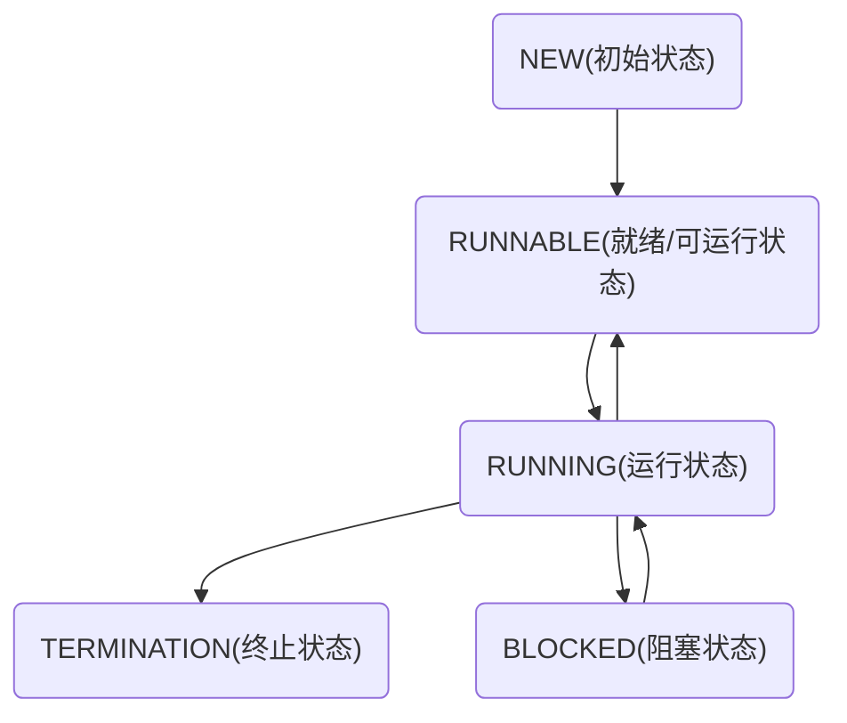
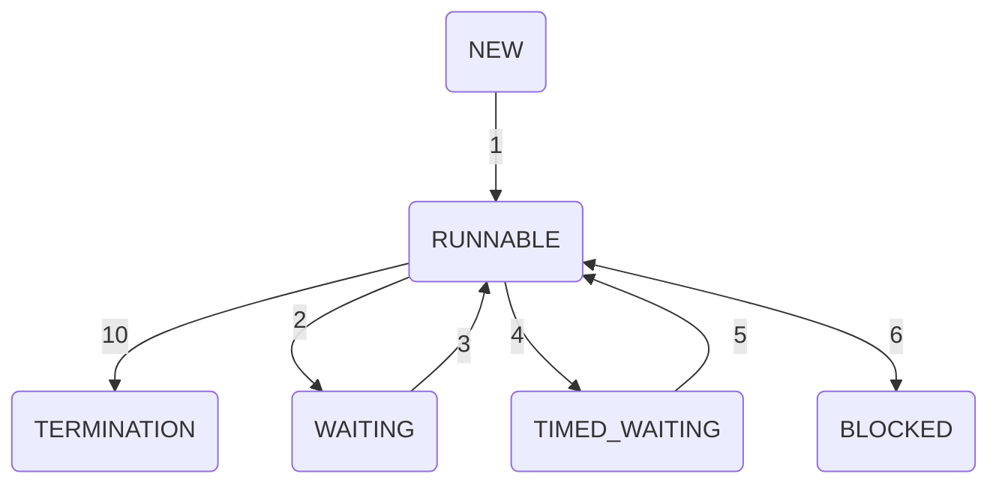

> 操作系统层面的线程的五种状态

```mermaid
graph TD
a("NEW(初始状态)") --> b
b("RUNNABLE(就绪/可运行状态)") -->c
c("RUNNING(运行状态)") -->b
c --> d
c --> e
e("BLOCKED(阻塞状态)") -->c
d("TERMINATION(终止状态)")
```

> Java语言API层面，根据Thread.State枚举，分为六种状态

```mermaid
graph TD
a("NEW") -- 1 --> b    
b("RUNNABLE") -- 10 --> g("TERMINATION")
b -- 2 --> c("WAITING")
c -- 3 --> b
b -- 4 --> d
d("TIMED_WAITING") -- 5 --> b
b <-- 6 --> e("BLOCKED")

```